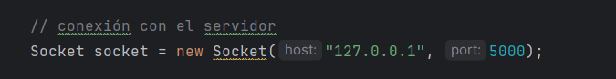
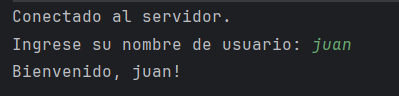
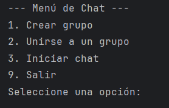
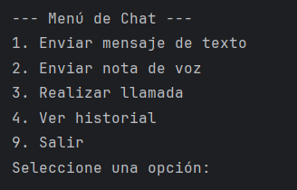

# Chat Multiple Client
# Participantes: Juan Camilo Tobar, Mateo Rubio, Sara Diaz, Raul Quihua

## Nuestra aplicación tiene la siguientes funcionalidades: 
1. Crear grupo
2. Unirse grupo
3. Inicar chats
    
    3.1. Enviar mensaje de texto

    3.2. Enviar mensaje de audio

    3.3. Ver historial

# Paso 1:

## Ejecturar el servidor

Debemos ejecturar el archivo servidor para que los clientes se puedan conectar. Cabe decir que podemos cambiar los puertos de escucha y pero el predeterminado es el 5000.

# Paso 2:

## Ejectuar los clientes

Dentro de la clase client podemos modificar la ubicación del servidor y el puerto por el que está escuchando.

Y ejecutamos el client cuando queramos conectarnos al servidor.

# Paso 3:

## Ingresar nuestro nombre

Para poder conectarnos con el servidor nos piden nuestro nombre para que el servidor pueda reconocernos y poder enviarnos o enviar mensajes.

# Paso 4:

## Navegar

Ya dentro podemos navegar en el menu principal

Y en el menu de los chats

